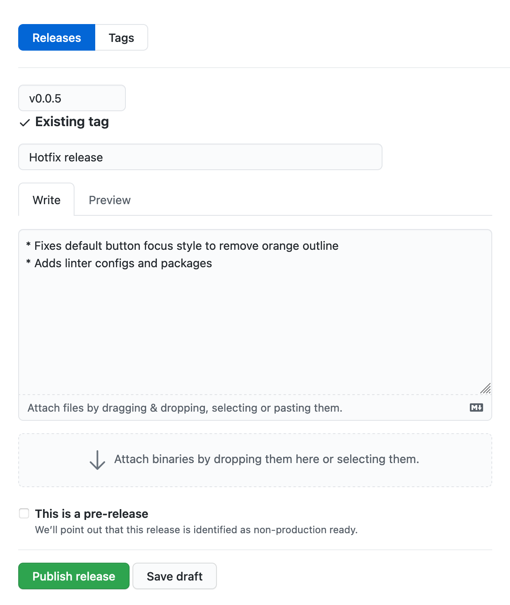

# `@askiggy/stardust`

The Iggy frontend component library and styleguide.

## Setup

Because this is a private package you'll need to set up a Personal Access Token to be able to install this in your project. [See Authenticating to GitHub Packages for more info](https://docs.github.com/en/packages/working-with-a-github-packages-registry/working-with-the-npm-registry#authenticating-to-github-packages).

For local development environments, you can set your personal access token to a local `.npmrc` file:

```
echo "//npm.pkg.github.com/:_authToken=TOKEN" >> ~/.npmrc
```

_Replace `TOKEN` with your own Personal Access Token_

For production environments, you'll need to create an `.npmrc` or `.yarnrc` config file and set the registry url for `@askiggy:registry`. This is needed for access to the `@askiggy/stardust` private package hosted in github.

With npm using an `.npmrc` file:

```
always-auth=true
@askiggy:registry=https://npm.pkg.github.com
//npm.pkg.github.com/:_authToken=${NPM_AUTH_TOKEN}
```

With yarn using a `.yarnrc` file:

```
"always-auth" "true"
"@askiggy:registry" "https://npm.pkg.github.com"
"//npm.pkg.github.com/:_authToken" "${NPM_AUTH_TOKEN}"
```

## Releasing a new Package

1. Bumpt the version (we try to follow the [Semantic Versioning](https://semver.org/) system)
2. Create a new tag, add summary, and push to remote:
   ```
   $ git tag -a {VERSION}
   $ git push --tags
   ```
3. [Draft a new release on GitHub](https://github.com/askiggy/stardust/releases/new) and **Pubish**.
      
